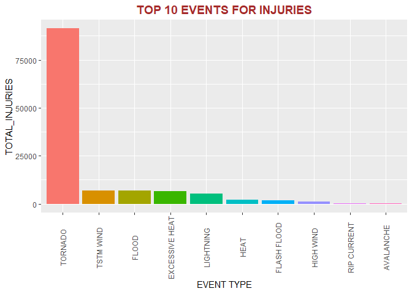

Natural Disaster Data Analysis
================
thenuv
17 July 2018

------------------------------------------------------------------------

Overview
--------

This is an analysis on the natural disaster events occured in the past in US. The data is sourced from National Oceanic and Atmospheric Administration's database. This study is focused on two areas. - Events that has caused the most *health* issues (Fatalities and Injuries). - Events haiving highest *economic* impact (Estimates on Property and Crop damages)

------------------------------------------------------------------------

Data Processing
---------------

The data required for this analysis was downloaded from NOAA database("<https://d396qusza40orc.cloudfront.net/repdata%2Fdata%2FStormData.csv.bz2>"). Its imported into R and processed as in the bellow sections.

### Dowload Data file

``` r
options(warn = -1)
suppressMessages(library(R.utils))

fileurl <- "https://d396qusza40orc.cloudfront.net/repdata%2Fdata%2FStormData.csv.bz2"
filename <- "StromData.bz2"

if (!file.exists(filename)) {
        download.file(fileurl, filename)
}
if (!(file.exists("StromData.csv"))) {
        bunzip2(filename, "StromData.csv",  remove = FALSE)        
}
```

### Import Data into R

``` r
suppressMessages(library(data.table))

strom_df <- fread("StromData.csv", sep = ",", header= TRUE)  [, c("EVTYPE", "FATALITIES", "INJURIES", "PROPDMG", "PROPDMGEXP", "CROPDMG", "CROPDMGEXP")]
str(strom_df)
```

    ## Classes 'data.table' and 'data.frame':   902297 obs. of  7 variables:
    ##  $ EVTYPE    : chr  "TORNADO" "TORNADO" "TORNADO" "TORNADO" ...
    ##  $ FATALITIES: num  0 0 0 0 0 0 0 0 1 0 ...
    ##  $ INJURIES  : num  15 0 2 2 2 6 1 0 14 0 ...
    ##  $ PROPDMG   : num  25 2.5 25 2.5 2.5 2.5 2.5 2.5 25 25 ...
    ##  $ PROPDMGEXP: chr  "K" "K" "K" "K" ...
    ##  $ CROPDMG   : num  0 0 0 0 0 0 0 0 0 0 ...
    ##  $ CROPDMGEXP: chr  "" "" "" "" ...
    ##  - attr(*, ".internal.selfref")=<externalptr>

### Analyse most harmfull event for human health

``` r
suppressMessages(library(dplyr))
suppressMessages(library(ggplot2))

# Group by Events and Summarize
h <- strom_df %>% 
        group_by(EVTYPE) %>%  
        summarize (TOTAL_FATALITIES = sum(FATALITIES, na.rm = TRUE), TOTAL_INJURIES = sum(INJURIES, na.rm = TRUE))

h <- arrange(h, desc(TOTAL_FATALITIES ), desc(TOTAL_INJURIES))
#h[1,]
hf <- round(h$TOTAL_FATALITIES[1] /sum(h$TOTAL_FATALITIES, na.rm=TRUE) *100, 2)
hi <- round(h$TOTAL_INJURIES[1] /sum(h$TOTAL_INJURIES, na.rm=TRUE) *100, 2)
inj <- head(h, 10)
options(scipen = 999)
```

The most harmful event for health was **TORNADO** with **5633** Fatalities and **91346** Injuries.

``` r
#FATALITIES
ggplot(inj, 
        aes(x=reorder(EVTYPE,-TOTAL_FATALITIES), 
        y=TOTAL_FATALITIES, 
        fill=reorder(EVTYPE, -TOTAL_FATALITIES))) +
geom_bar(stat="identity" )  +
labs(title = "TOP 10 EVENTS WITH HIGH FATALITIES ") + 
labs(x = "EVENT TYPE") +
theme(
    legend.position="none",
    axis.text.x=element_text(angle=90, vjust=0.5), 
    plot.title = element_text(color= "brown", size = 14, face = "bold", hjust = 1/2)
)
```


``` r
#INJURIES
ggplot(inj,
        aes(x=reorder(EVTYPE, -TOTAL_INJURIES), 
        y=TOTAL_INJURIES, 
        fill=reorder(EVTYPE, -TOTAL_INJURIES))) +
geom_bar(stat="identity" )  +
labs(title = "TOP 10 EVENTS FOR INJURIES") + 
labs(x = "EVENT TYPE") +
theme(
    legend.position="none",
    axis.text.x=element_text(angle=90, vjust=0.5), 
    plot.title = element_text(color= "brown", size = 14, face = "bold", hjust = 1/2)
) 
```



### Analyse Event with great economic consequence

``` r
d <- strom_df %>% select (EVTYPE, PROPDMG, PROPDMGEXP, CROPDMG, CROPDMGEXP) 
d = within(d, {
    cval=NA 
    cval[CROPDMGEXP != ""]=1
    cval[CROPDMGEXP %in% c("H","h")]=100
    cval[CROPDMGEXP %in% c("K","k")]=1000
    cval[CROPDMGEXP %in% c("M","m")]=1000000
    cval[CROPDMGEXP %in% c("B", "b")]=1000000000
})
d<- d %>% mutate ( CROPVALUE = cval * CROPDMG)
d = within(d, {
    pval=NA 
    pval[PROPDMGEXP != ""]=1
    pval[PROPDMGEXP %in% c("H","h")]=100
    pval[PROPDMGEXP %in% c("K","k")]=1000
    pval[PROPDMGEXP %in% c("M","m")]=1000000
    pval[PROPDMGEXP %in% c("B", "b")]=1000000000
})
d<- d %>% mutate ( PROPVALUE = pval * PROPDMG)
d<- d %>% mutate ( DAMAGEVALUE = PROPVALUE + CROPVALUE)
d <- select(d, EVTYPE, DAMAGEVALUE) %>% 
        group_by(EVTYPE) %>% 
        summarize (TOTALDAMAGEVALUE = sum(DAMAGEVALUE, na.rm = TRUE))
d <- arrange(d, desc(TOTALDAMAGEVALUE ))
#d[1,]
d1 <- round(d$TOTALDAMAGEVALUE[1] /sum(d$TOTALDAMAGEVALUE, na.rm=TRUE) *100, 2)
d2 <- paste(round(d$TOTALDAMAGEVALUE[1]/1000000000, 2), "BN $")
dmg <- head(d,5)
```

**FLOOD** had high economic impact with estimated losses of **138.01 BN $**.

``` r
# Economic losses
ggplot(dmg, aes(x=reorder(EVTYPE, -TOTALDAMAGEVALUE), y=TOTALDAMAGEVALUE/1000000000, fill=reorder(EVTYPE, -TOTALDAMAGEVALUE))) +
geom_bar(stat="identity" )  +
labs(title = "TOP 5 EVENTS Causing Economic Damage") + labs(x = "EVENT TYPE", y="Estimated Damage in Billion $") +
theme(
    legend.position="none",
    axis.text.x=element_text(angle=90, vjust=0.5), 
    plot.title = element_text(color= "brown", size = 14, face = "bold", hjust = 1/2)
) 
```


``` r
options(warn = 0)
```

------------------------------------------------------------------------

Variables used in the study
---------------------------

### EVTYPE

Event type is a descriptive variable of the natural calamity occured. The classfication done by the department is used as is. It not profiled further.

### FATALITIES

The number of Fatality caused by the weather. Its measured in numeric type. It includes the Direct and indirect fatalities.

### INJURIES

Injuries caused directly or indirectly to the public due to the weather event. Its a numeric type.

### PROPDMG

The value of estimated property damage casued by the event. The unit of measurement is numeric. This variable should be observed with the magnitude measured in PROPDMGEXP.

### PROPDMGEXP

This has the value of magnitude for the property damage. Its a character type. The following values are used to derive and estimate values. - B/b : Billions - M/m : Millions - K/k : Thousands - H/h : Hundreds

### CROPDMG

The value of estimated Crop damage casued by the event. The unit of measurement is numeric. This variable should be observed with the magnitude measured in CROPDMGEXP.

### CROPDMGEXP

This has the value of magnitude for the crop damage. Its a character type. The following values are used to derive and estimate values. - B/b : Billions - M/m : Millions - K/k : Thousands - H/h : Hundreds

------------------------------------------------------------------------

Results
-------

Its found from the analysis Tornado's has been most harmful to health. Flood events had huge economical impact. Bellow are the findings

-   **TORNADO** has contributed to **37.19%** of total Fatalities.
-   **TORNADO** has contributed to **65%** of total Injuries.
-   **FLOOD** has caused economical losses of about **52.78%** of total damages, which is estimated at **138.01 BN $**.

------------------------------------------------------------------------

### Reference :

<http://www.nws.noaa.gov/directives/>. <https://d396qusza40orc.cloudfront.net/repdata%2Fpeer2_doc%2Fpd01016005curr.pdf>

------------------------------------------------------------------------
