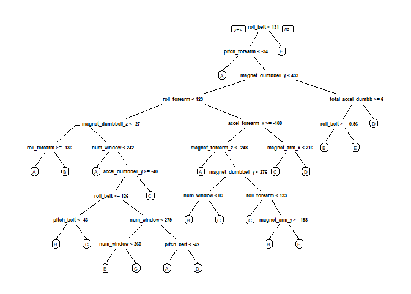

Human Activity Recognition - A Prediction with Wearables
================
thenuv
3 August 2018

Overview
--------

This is a study with data on Human activity recognition. A prediction is made on the way in which the exercise was performed. There are 2 datasets for Tranining and Test. Tree based modeling was built for the traning set and a subset of it is used to evaluate the prediction. After comparing the models, the choosen one is used to predict the test set.

Data Processing
---------------

``` r
# Load Libraries
suppressWarnings(library(caret))
```

    ## Loading required package: lattice

    ## Loading required package: ggplot2

``` r
suppressWarnings(library(randomForest))
```

    ## randomForest 4.6-14

    ## Type rfNews() to see new features/changes/bug fixes.

    ## 
    ## Attaching package: 'randomForest'

    ## The following object is masked from 'package:ggplot2':
    ## 
    ##     margin

``` r
suppressWarnings(library(rpart))
suppressWarnings(library(rpart.plot))

# Download Data
fileurl1 <- "https://d396qusza40orc.cloudfront.net/predmachlearn/pml-training.csv"
fileurl2 <- "https://d396qusza40orc.cloudfront.net/predmachlearn/pml-testing.csv"
filename1 <- "pml_training.csv"
filename2 <- "pml_testing.csv"
if (!file.exists(filename1)) {
        download.file(fileurl1, filename1)
}

if (!file.exists(filename2)) {
        download.file(fileurl2, filename2)
}
# Import Data
df_train <- read.csv(filename1) 
df_test <- read.csv(filename2) 
```

Clense & Explore
----------------

        As part of cleansing and filtering, the following approach is used to remove some variables as they may not contribute as predictors in the model to be trained.

-   Filter Near Zero Variance Columns
-   Misc columns like Name, X & timestamp
-   Columns having NA's.

``` r
dim(df_train)
```

    ## [1] 19622   160

``` r
dim(df_test)
```

    ## [1]  20 160

``` r
#str(df_train)
#str(df_test)
table(df_train$classe)
```

    ## 
    ##    A    B    C    D    E 
    ## 5580 3797 3422 3216 3607

``` r
# Filter Near Zero Variance columns
NZV <- nearZeroVar(df_train, saveMetrics = TRUE)
#head(NZV,10)
df_train <- df_train[,!NZV$nzv] 
df_test <- df_test[,!NZV$nzv]

# Drop columns which wont be used in the study
drops <- grepl("^X|user_name|timestamp", names(df_train))
df_train <- df_train[,!drops] 
df_test <- df_test[,!drops]

# Retain columns not having NA's
nonnacol <- (colSums(is.na(df_train)) == 0)
df_train <- df_train[, nonnacol] 
df_test <- df_test[, nonnacol] 

dim(df_train)
```

    ## [1] 19622    54

``` r
dim(df_test)
```

    ## [1] 20 54

``` r
# Split training data into training and validation
set.seed(2345)
inTrain <- createDataPartition(df_train$classe, p=.70, list=FALSE)
training <- df_train[inTrain, ]
validation <- df_train[-inTrain, ]
dim(training)
```

    ## [1] 13737    54

``` r
dim(validation)
```

    ## [1] 5885   54

### Model 1 with rpart approach

Tree based rpart model is built on training set as bellow.

``` r
md1 <- rpart(classe ~. , data=training, method="class")
prp(md1)
```



Predict Model 1 with Validation data set.

``` r
predict1 <- predict(md1, validation, type="class")
confusionMatrix (validation$classe, predict1)
```

    ## Confusion Matrix and Statistics
    ## 
    ##           Reference
    ## Prediction    A    B    C    D    E
    ##          A 1500   55   25   89    5
    ##          B  192  684   89  138   36
    ##          C   35   67  850   64   10
    ##          D   57  103   80  673   51
    ##          E   48  117   71  156  690
    ## 
    ## Overall Statistics
    ##                                           
    ##                Accuracy : 0.7472          
    ##                  95% CI : (0.7358, 0.7582)
    ##     No Information Rate : 0.3113          
    ##     P-Value [Acc > NIR] : < 2.2e-16       
    ##                                           
    ##                   Kappa : 0.6794          
    ##  Mcnemar's Test P-Value : < 2.2e-16       
    ## 
    ## Statistics by Class:
    ## 
    ##                      Class: A Class: B Class: C Class: D Class: E
    ## Sensitivity            0.8188   0.6667   0.7623   0.6009   0.8712
    ## Specificity            0.9571   0.9064   0.9631   0.9389   0.9230
    ## Pos Pred Value         0.8961   0.6005   0.8285   0.6981   0.6377
    ## Neg Pred Value         0.9212   0.9279   0.9455   0.9092   0.9788
    ## Prevalence             0.3113   0.1743   0.1895   0.1903   0.1346
    ## Detection Rate         0.2549   0.1162   0.1444   0.1144   0.1172
    ## Detection Prevalence   0.2845   0.1935   0.1743   0.1638   0.1839
    ## Balanced Accuracy      0.8879   0.7865   0.8627   0.7699   0.8971

``` r
accuracy_md1 <- postResample(predict1, validation$classe)[1]
se_md1 <- 1- as.numeric(confusionMatrix(validation$classe, predict1)$overall[1])
```

The estimated *accuracy* for this model is ***74.71%*** with expected out of sample error ***25.29%***.

### Model 2 Random Forest approach

We apply the Random Forest method to train the data. Cross validation with 5 fold opton is specified in the traning control parameters.

``` r
md2 <- train(classe~., data=training, method="rf", trControl = trainControl(method="cv", 5), ntree=50)
md2
```

    ## Random Forest 
    ## 
    ## 13737 samples
    ##    53 predictor
    ##     5 classes: 'A', 'B', 'C', 'D', 'E' 
    ## 
    ## No pre-processing
    ## Resampling: Cross-Validated (5 fold) 
    ## Summary of sample sizes: 10990, 10990, 10991, 10988, 10989 
    ## Resampling results across tuning parameters:
    ## 
    ##   mtry  Accuracy   Kappa    
    ##    2    0.9917008  0.9895015
    ##   27    0.9957052  0.9945672
    ##   53    0.9939584  0.9923577
    ## 
    ## Accuracy was used to select the optimal model using the largest value.
    ## The final value used for the model was mtry = 27.

Predict with Model2 on validation data set.

``` r
# Validate
predict2 <- predict(md2, validation)
confusionMatrix(validation$classe, predict2)
```

    ## Confusion Matrix and Statistics
    ## 
    ##           Reference
    ## Prediction    A    B    C    D    E
    ##          A 1672    1    0    0    1
    ##          B    2 1136    1    0    0
    ##          C    0    2 1024    0    0
    ##          D    0    0    5  959    0
    ##          E    0    0    0    2 1080
    ## 
    ## Overall Statistics
    ##                                          
    ##                Accuracy : 0.9976         
    ##                  95% CI : (0.996, 0.9987)
    ##     No Information Rate : 0.2845         
    ##     P-Value [Acc > NIR] : < 2.2e-16      
    ##                                          
    ##                   Kappa : 0.997          
    ##  Mcnemar's Test P-Value : NA             
    ## 
    ## Statistics by Class:
    ## 
    ##                      Class: A Class: B Class: C Class: D Class: E
    ## Sensitivity            0.9988   0.9974   0.9942   0.9979   0.9991
    ## Specificity            0.9995   0.9994   0.9996   0.9990   0.9996
    ## Pos Pred Value         0.9988   0.9974   0.9981   0.9948   0.9982
    ## Neg Pred Value         0.9995   0.9994   0.9988   0.9996   0.9998
    ## Prevalence             0.2845   0.1935   0.1750   0.1633   0.1837
    ## Detection Rate         0.2841   0.1930   0.1740   0.1630   0.1835
    ## Detection Prevalence   0.2845   0.1935   0.1743   0.1638   0.1839
    ## Balanced Accuracy      0.9992   0.9984   0.9969   0.9985   0.9993

``` r
accuracy_md2 <- postResample(predict2, validation$classe)[1]
se_md2 <- 1- as.numeric(confusionMatrix(validation$classe, predict2)$overall[1])
```

The outcome accuracy is estimated at ***99.69%*** with sample error of ***0.31% ***.

Predict Test Data
-----------------

Since the estimated outcome accuracy of Random Forest approach is better than the other model, we use it to predict the test data set.

``` r
# Predict Test
predictTest <- predict(md2, df_test)
```

### Reference

<http://groupware.les.inf.puc-rio.br/har>
